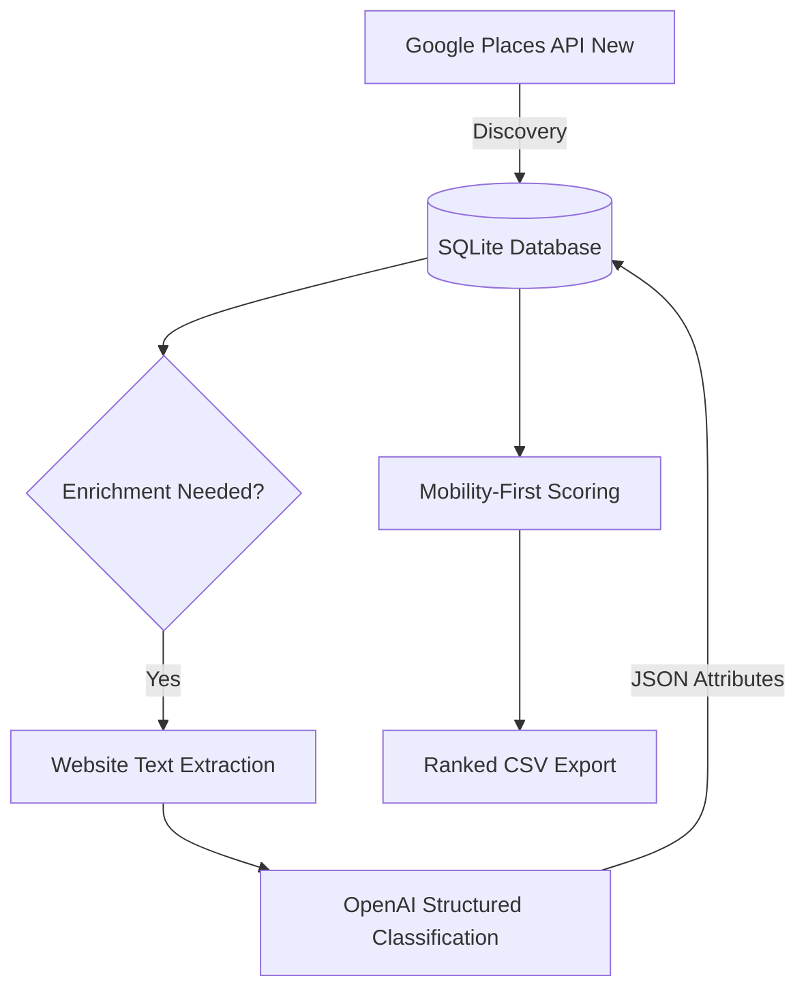

```markdown
# Territory Intelligence System (TIS)
### B2B Sales Infrastructure – Newfoundland & Labrador


## 📋 Executive Summary

The **Territory Intelligence System** is a production-grade, persistent B2B sales engine built to create a structural advantage in the Newfoundland & Labrador market.

This is not a one-off script; it is **sales infrastructure**. It converts real-world physical business data into a ranked, call-ready opportunity database using:
* **Google Places API (New)** for discovery.
* **SQLite** for persistent territory memory.
* **OpenAI** for structured industry classification.
* **Mobility-First Scoring** to prioritize high-value targets.

---

## 🎯 Strategic Objective

### Product Priority
1.  **Mobility** (Primary Revenue Driver) 📱
2.  **Security** 🔒
3.  **VoIP** 📞
4.  **Fleet Management** (Attach Model) 🚚

### Ideal Customer Profile (ICP)
* **Field-based operators:** Skilled trades (plumbing, electrical, HVAC, fire protection).
* **Industrial:** Logistics, warehousing, marine, and fisheries.
* **Operations-heavy:** Dispatch-driven or after-hours businesses.
* *Note: Fleet ownership is a signal, not a hard requirement.*

---

## 🏗️ High-Level Architecture



---

## 📂 Repository Structure

```text
territory-intel/
├── src/
│   ├── google_places.py    # API Discovery (Field masks, NL biasing)
│   ├── store.py            # Persistence (SQLite, Idempotent upserts)
│   ├── classifier.py       # Website Extraction & OpenAI Logic
│   ├── scoring.py          # Weighted Priority Logic
│   ├── config.py           # Env vars & Thresholds
│   └── utils/              # Logging & Helpers
├── scripts/
│   ├── run_all.py          # End-to-end Pipeline
│   ├── test_run_all.py     # Sanity Check (St. John's only)
│   ├── init_test_db.py     # Reset test database
│   └── classify_from_db.py # AI Enrichment (No Google API calls)
├── data/
│   └── exports/            # Ranked CSV outputs
├── .env                    # API Keys (Gitignored)
├── .gitignore
└── README.md

```

---

## 🛠️ Core Components

### 1. Google Discovery Layer (`src/google_places.py`)

* Uses **Places API (New)**.
* Strict field mask enforcement to control costs.
* Location biasing specifically for Newfoundland & Labrador.
* No raw JSON leakage; structured dataclasses only.

### 2. Persistence Layer (`src/store.py`)

* **Database:** SQLite.
* **Key Design:** `place_id` is the PRIMARY KEY.
* **Memory:** Tracks `first_seen` and `last_seen` to build long-term territory history.
* **Optimization:** Idempotent upserts prevent duplicates.

### 3. Website Extraction (`src/classifier.py`)

* Homepage-only extraction (v1 constraint for speed).
* Defensive timeout handling.
* Pure text processing (strips HTML/JS).

### 4. OpenAI Classification

Returns strict **Structured JSON** with the following fields:

* `industry_bucket`
* `mobility_fit` (0-5)
* `security_fit` (0-5)
* `voip_fit` (0-5)
* `fleet_attach` (Boolean signal)
* `ai_reason` (Context for the sales rep)

### 5. Scoring Engine (`src/scoring.py`)

Calculates a `total_score` to sort the dialing list.

* **Inputs:** Product fit levels, Google ratings, Review counts, Operational signals (24/7, Dispatch).
* **Output:** Descending sort for immediate execution.

---

## 🚀 Execution Modes

### 1. Full Territory Run

*Province-wide discovery, enrichment, and export.*

```bash
python -m scripts.run_all

```

### 2. DB-Only Classification (Cost Saver)

*Classifies businesses already in the DB without making Google API calls.*

```bash
python -m scripts.classify_from_db --limit 200

```

### 3. Sanity Test

*Restricted scope (St. John's) to validate pipeline.*

```bash
python -m scripts.init_test_db
python -m scripts.test_run_all

```

---

## 📊 Output Format

Exports are generated in `data/exports/` strictly for execution (not analysis).

| Name | Phone | Industry | Mobility Fit | Total Score | AI Reason |
| --- | --- | --- | --- | --- | --- |
| **Example Electric** | 709-555-0123 | Skilled Trades | 5 | 94.5 | "High field activity, mentions 24/7 dispatch." |

**Sorting:** `total_score DESC`

---

## 💰 Cost Control Mechanisms

1. **Place ID Deduplication:** Never pay for the same lead twice.
2. **Enrichment Gating:** Only calls AI if data is missing.
3. **Website Hashing:** Detects if a site has changed before re-scraping.
4. **Classification Caps:** Limits runs to specific batch sizes (e.g., 200/day).

---

## 🗺️ Roadmap

* [x] **v1:** Province-wide discovery, Homepage extraction, AI ranking.
* [ ] **v2:** Multi-page extraction, Freshness gating, Search logging.
* [ ] **v3:** Territory heat mapping, Competitive carrier inference.

---

## 👨‍💻 Author Context

Built for **Newfoundland & Labrador** territory execution by a technical B2B telecom operator & MSc Computer Engineer.

```

```
